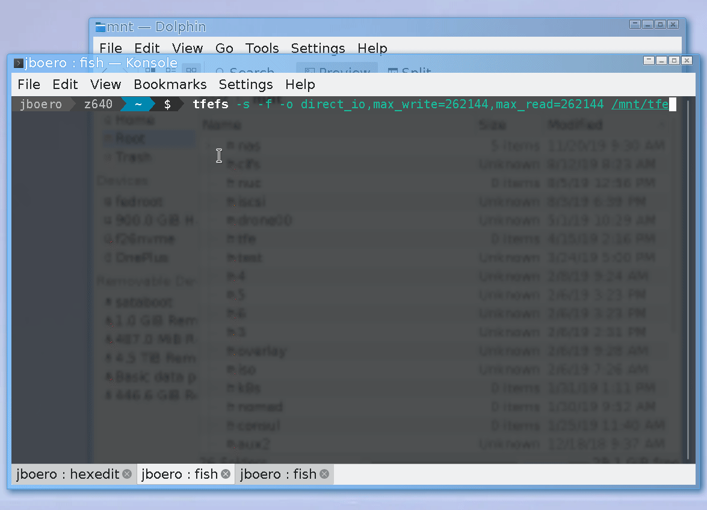

# Why HashiFUSE?
Experimental FUSE clients for Hashicorp REST APIs.  These make it simple to adopt Hashicorp products by mapping basic REST API functions to FUSE filesystems.  Note they are beta PoC.  Do not use them for any production clusters.

By mapping a REST endpoints to a filesystem, complex Vault secrets, Consul KV values, and Nomad jobs can be created, read, updated, deleted, and browsed (CRUD... B).  This can all be done with your existing tools, scripts, rsyncs, GUI+drag and drop, all without worrying about fat-fingering a REST call.

# Building
I'm not a full-time dev these days but I used to write FUSE filesystems quite a bit.  My choices of language and IDE are clearly dated, but MonoDevelop 5.9 was always a good IDE for me to debug multithreaded C++ FUSE apps, and git integration helps you check out directly from the IDE even if it's ancient.  Anyone who would like to port these to a different language is more than welcome.

_Dependencies for all three: libFUSE, libCurl, libjsoncpp_

# Thoughts on FUSE
Linus Torvalds has famously said FUSE is a toy.  He's absolutley right.  While working with Gluster I once wrote a dummy fs that performed no operations whatsoever to test maximum theoretical throughput via kernel mode switches.  On a Broadwell system maxing out a single core 100%, the most I would ever be able to read or write maxed out at about 1.0 GB/s.  Given kernel cache and RAMFS exceed 8GB/s on DDR3 with zero CPU load, it's pretty clear FUSE should never be used for block storage.  The good news is these are simple small bits of REST call, so FUSE is an ideal toy.  Bottom line - don't trust these to have optimal performance.

# ConsulFS
Simple browseable CRUD dir+file structure on KV storage.  Changes are made directly inside Consul so be careful.  Note that Consul supports ambiguous file/dir paths, so you can have a key(file) and a dir with the same name.  Filesystems can't distinguish this and directories take precedent.

Demo: [TBD]

# VaultFS
Simple browseable CRUD dir+secret structure of Vault KV secrets.  Operations for other engines is undefined, but may work with correct directory structure.  There is nothing to stop you doing a generic read of PKI, SSH, DB secrets etc.

Demo Video:

# NomadFS
Simple browseable CRUD file structure of Nomad jobs.  As this uses the REST API it requires JSON syntax instead of HCL.  You can read/copy/replace/edit Nomad jobs using the tool of your choice.

Demo Video:

# TFEFS
Terraform Enterprise organization + workspace browser, allowing access to runs, states, policies, variables, and more.

Demo:

# KubernetesFS
Kubernetes namespace browser, allowing access to all resources in K8s v1.14.  This includes, DaemonSets, Deployments, RCs, Pods, Services, and more. Experimental.  Works with OpenShift too.  Versions subject to unknown compatibility.

Demo Video:

